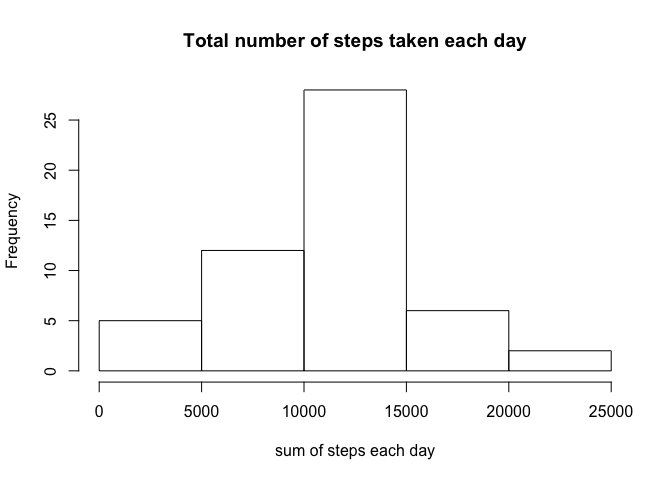
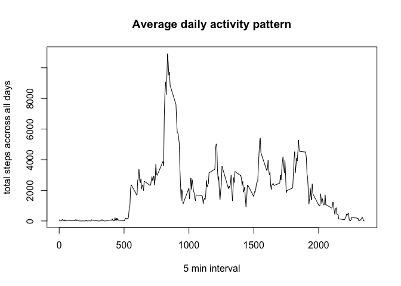
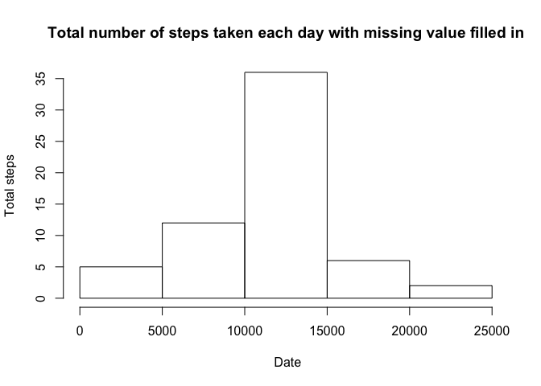
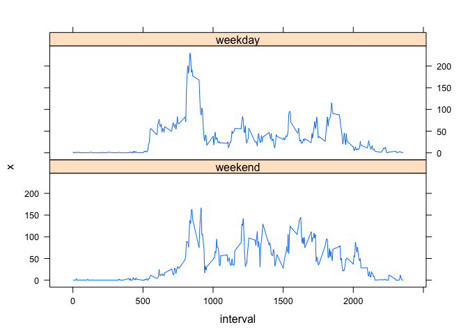

# Reproducible Research: Peer Assessment 1


## Loading and preprocessing the data

Read data into R and transform the data to a format suitable for the analysis.


```r
library(reshape2)
activity<-read.csv("/Users/wen_p/Downloads/activity.csv",header=TRUE)
activitymd<-melt(activity,id="date",measure.vars=c("steps","interval"))
```


## What is mean total number of steps taken per day?

Calculate the total number of steps taken per day and plot a histogram of it.


```r
stepsData<-dcast(activitymd, date ~ variable, sum)
hist(stepsData$steps,main= "Total number of steps taken each day",xlab="sum of steps each day")
```

 

To calculate the mean and median of total steps taken each day : 

```r
meanvalue=mean(stepsData$steps,na.rm=TRUE)
meanvalue
```

```
## [1] 10766.19
```

```r
mediamvalue=median(stepsData$steps, na.rm=TRUE)
mediamvalue
```

```
## [1] 10765
```

## What is the average daily activity pattern?

First, let's transform the format suitable for this analysis:

```r
activitybyinterval<-melt(activity,id=c("interval","date"),measure.vars="steps")
intervalData=dcast(activitybyinterval, interval ~ variable, sum, na.rm=TRUE)
```
Then, we can plot a time series pot of the 5 minute interval and the average number of steps taken across all days.


```r
plot(intervalData$interval,intervalData$steps,type="l",main="Average daily activity pattern", xlab="5 min interval", ylab="total steps accross all days")
```

 

Get the interval which have the maximum steps taken accross all days:


```r
intervalmax<-intervalData[intervalData$steps==max(intervalData$steps),1]
intervalmax
```

```
## [1] 835
```


## Imputing missing values

Imputting missing values : Calculate and report the total number of missing values in the dataset

```r
Count_of_missing_value<-length(which(is.na(activity$steps)))
Count_of_missing_value
```

```
## [1] 2304
```

Here let's develop a strategy to fill in all the missing values in the dataset. The strategy is to use the mean steps for that 5 minutes interval.

Create a new dataset that is equal to the original dataset but with the filled data in to replace "NA"s.

```r
activity_filled <-activity
meansteps<-dcast(activitybyinterval, interval ~ variable, mean, na.rm=TRUE)
meansteps$steps<-as.integer(meansteps$steps)
for (i in 1:length(activity_filled$steps)) { 
  if (is.na(activity_filled$steps[i])==TRUE) {
  activity_filled$steps[i]=meansteps[meansteps$interval==activity_filled$interval[i],2]
  }
}
```

Make a histogram of the total number of steps taken each day 

```r
activity_filled_melt<-melt(activity_filled,id=c("date","interval"),measure.var="steps")
activity_filled_bydate<-dcast(activity_filled_melt, date ~ variable, sum)
hist(activity_filled_bydate$steps,main="Total number of steps taken each day with missing value filled in", xlab=" Date" , ylab="Total steps")
```

 
Calculate the mean and medium total number of steps taken per day 

```r
meansteps_with_filledData<-mean(activity_filled_bydate$steps)
meansteps_with_filledData
```

```
## [1] 10749.77
```

```r
mediansteps_with_filledData<-median(activity_filled_bydate$steps)
mediansteps_with_filledData
```

```
## [1] 10641
```
The mean value of total stpes of the filled dataset is 10749.77 very close to the mean value of the original dataset 10766.19. The median of total steps of the filled dataset 10641 is a little bit different from the median value of the original dataset 10765. The impact of imputting missing value to the esitmate is very slightly interms of estimating daily activity. It will add more data points to the mean value of total steps by date.

## Are there differences in activity patterns between weekdays and weekends?

Add a column with factor vaue indicating if a date is weekday or weekend


```r
weekdays<-c("Monday","Tuesday","Wednesday","Thursday","Friday")
activity_filled$day<-factor((weekdays(as.Date(activity_filled$date,'%Y-%m-%d')) %in% weekdays) +1L, levels=1:2, labels=c("weekend","weekday"))
```

Transform Data


```r
activity_filled_melt<-melt(activity_filled,id=c("day","interval","date"),measure.vars="steps")
activity_filled_Wday<-aggregate(activity_filled_melt$value,list(interval=activity_filled_melt$interval,wday=activity_filled_melt$day),mean)
```

Make a panel plot containing a time series plot (i.e. type = "l") of the 5-minute interval (x-axis) and the average number of steps taken, averaged across all weekday days or weekend days (y-axis).


```r
library(lattice)
xyplot(x ~ interval| wday,type="l",data=activity_filled_Wday,layout=c(1,2))
```

 

